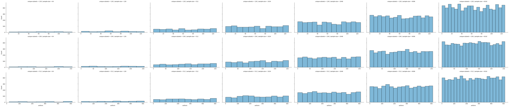
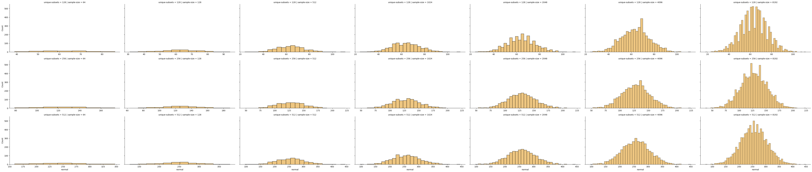
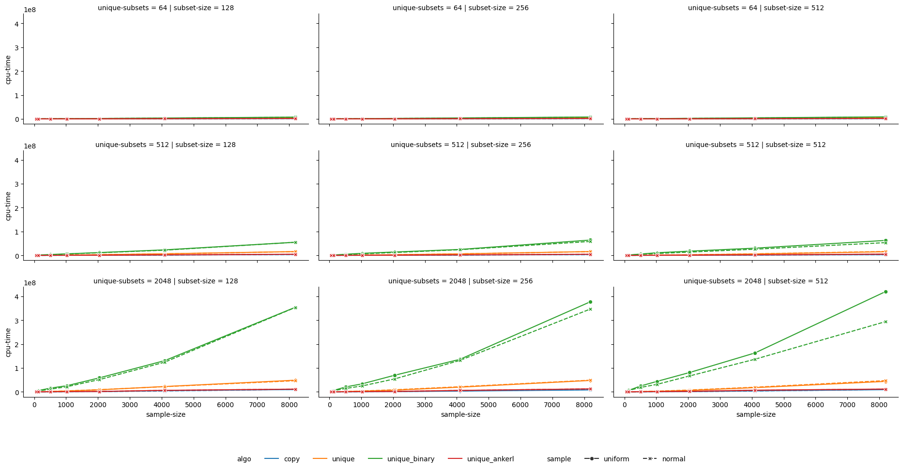

# disjoint

Benchmarking different algorithms for finding unique binary vectors in a vector of binary vectors based on the data distribution. Why is this repository named `disjoint`? You have to be good at something in life. I am good at misnaming things. What was the motivation behind this? An excuse to use google benchmark python bindings.

## Algorithms

- `unique`: finds unique vectors by sorting the input and running `std::unique`
- `unique_binary`: divide and conquer approach where we split the input into subgroups based on a fact whether a vector has a field set to true or false
- `unique_ankerl`: finding unique vectors using an unordered set in combination with `wyhash`

Remember; I am good at misnaming things so these algorithms deserve better names.

## Data

Test data was generated using numpy. For more details check out `scripts` folder.

### Sample distributions

#### Uniform sample

#### Normal sample

### Results

